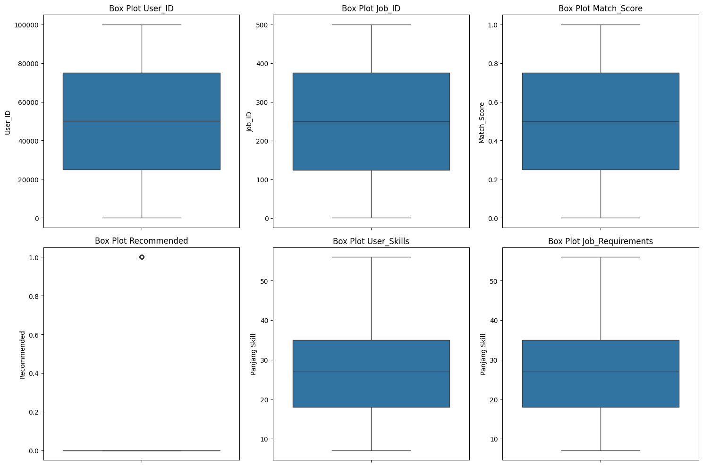
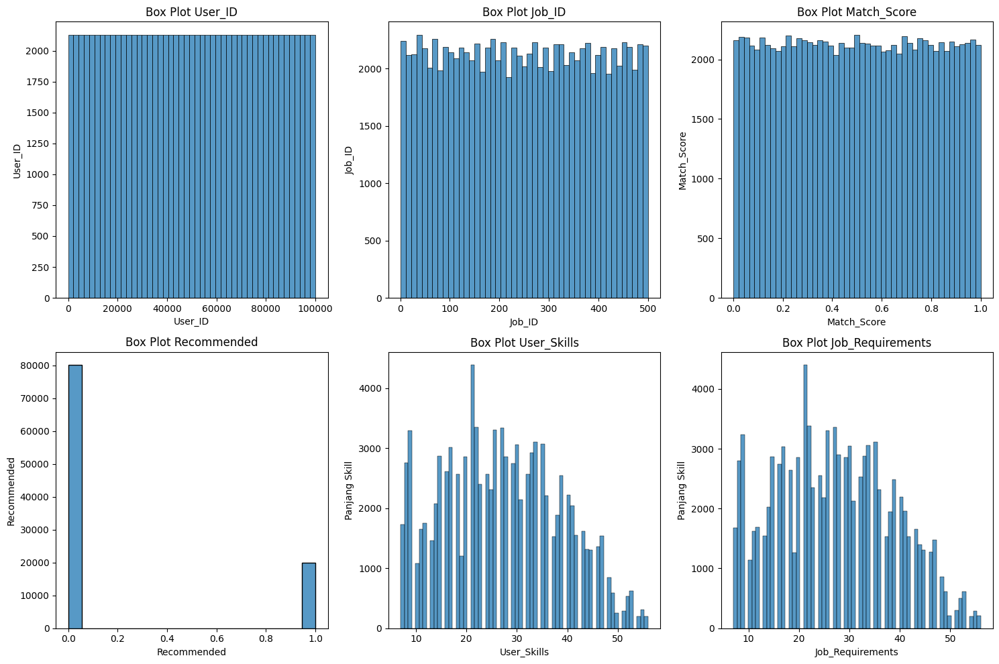
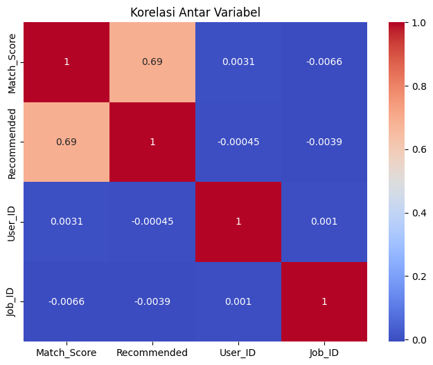
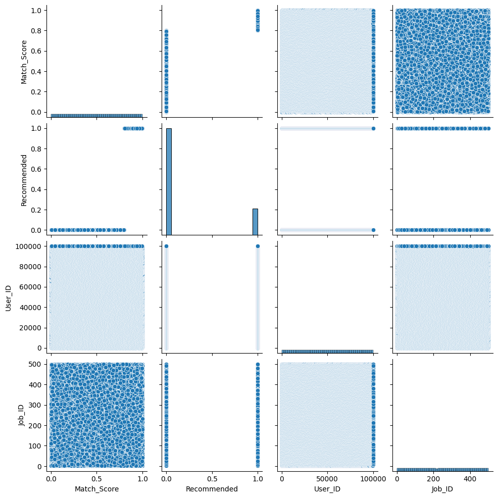
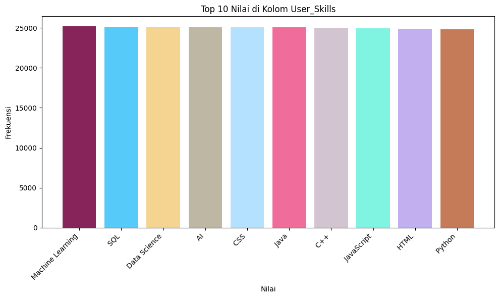
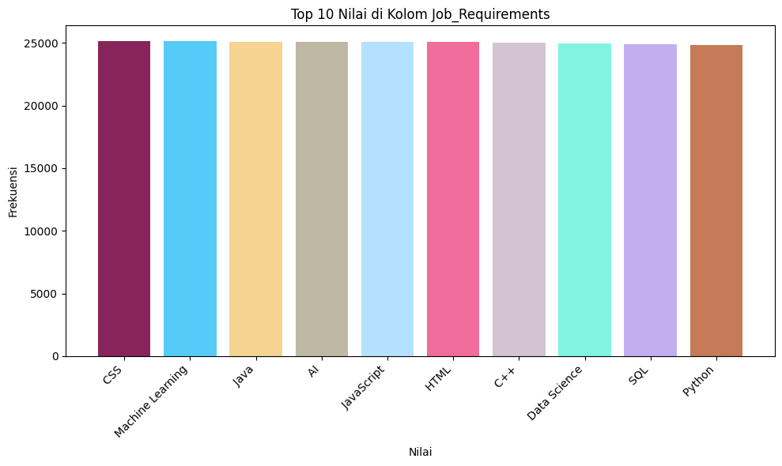

# Laporan Proyek Machine Learning - Sinta Siti Nuriah
---

### By. [Sinta Siti Nuriah](https://www.linkedin.com/in/sintasitinuriah/) 


## Domain Proyek
Terdapat sekitar 80% mahasiswa di Indonesia bekerja tidak sesuai dengan jurusan kuliahnya. Padahal anggapan bahwa jurusan kuliah akan menentukan arah karier di masa depan masih banyak dipercayai oleh masyarakat[[1]](https://e-journals.unmul.ac.id/index.php/PSIKO/article/view/12315). Hal-hal yang menyebabkan tejadinya kekeliruan ini antara lain:
- Minat, dan misi akan berubah seiring berjalannya waktu
- Lowongan kerja terbatas, tidak sebanding dengan jumlah lulusan. Hal ini menyebabkan statement "Dari pada gak kerja, mending kerjain yang ada!"

Masalah ini perlu diselesaikan secepatnya, mengingat angka pengangguran pada tahun 2023 di Indonesia mencapai 7,86 juta orang, atau setara dengan 5,32% dari total angkatan kerja nasional[[2]](https://journal.stekom.ac.id/index.php/kompak/article/view/1866). Kemungkinan terbesar angka pengangguran ini akan bertambah seiring berjalannya waktu, maka dari itu harapan untuk pengembaagan job recommendation system ini menjadi solusi untuk meminimaliris angkan pengangguran dan pekerjaan yang tidak sesuai dengan bidangnya. 

---
# Business Understanding

## a. Problem Statement
- Tingginya ketidaksesuaian antara pekerjaan dan jurusan kuliah.
  Sekitar 80% mahasiswa di Indonesia bekerja tidak sesuai dengan jurusannya. Hal ini menimbulkan masalah ketidaksesuaian keterampilan dan berisiko menurunkan produktivitas kerja.
- Ketidakseimbangan antara jumlah lulusan dan lowongan pekerjaan.
  Jumlah lulusan yang terus meningkat tidak sebanding dengan jumlah lapangan kerja yang tersedia, sehingga banyak lulusan terpaksa bekerja di bidang yang tidak sesuai atau bahkan menganggur.
- Kurangnya sistem yang dapat merekomendasikan pekerjaan secara personal.
  Saat ini belum banyak sistem yang dapat membantu pencari kerja mencocokkan profil akademik dan minat mereka dengan kebutuhan pasar tenaga kerja secara efektif dan otomatis.

## b. Goals
- Mengurangi tingkat mismatch antara jurusan dan pekerjaan.
  Dengan menyediakan sistem rekomendasi pekerjaan yang mempertimbangkan latar belakang pendidikan dan kompetensi individu.
- Membantu mahasiswa memahami potensi karier yang sesuai dengan perkembangan minat dan keterampilan mereka.
  Sistem yang fleksibel dan adaptif terhadap perubahan preferensi individu selama masa studi hingga setelah lulus.
- Mengembangkan job recommendation system berbasis data.
  Untuk mendukung pengambilan keputusan karier secara objektif, terarah, dan berbasis kecocokan antara profil pribadi dan permintaan pasar.

## c. Solution Statement
- Mengembangkan sistem rekomendasi pekerjaan berbasis ollaborative Filtering.
- Mengembangkan sistem rekomendasi berbasis Hybrid Recommendation System untuk meningkatkan personalisasi.
- Melakukan evaluasi terhadap model.
---

# Data Understanding
Dataset yang digunakan dengan keterangan sebagai berikut:
| Jenis      | Keterangan                                                                 |
|------------|------------------------------------------------------------------------------|
| Title      | Job Recommendation Dataset                                                 |
| Source     | [Kaggle](https://www.kaggle.com/datasets/lastman0800/job-recomendation-dataset) |
| License    | Unknown Authors                                               |
| Visibility | Public                                                                      |
| Tags       | Data Analytics, Data Visualization, Data Cleaning Classification                                   |
| Usability  | 4.71                                                                       |

Dataset yang disediakan adalah dataset rekomendasi pekerjaan yang terdiri dari enam kolom. Setiap baris dalam dataset ini merepresentasikan satu catatan unik yang menghubungkan seorang pengguna dengan sebuah pekerjaan dan mengevaluasi kesesuaian pekerjaan tersebut untuk pengguna. Berikut adalah penjelasan rinci dari masing-masing kolom dalam dataset:

| Kolom             | Tipe Data       | Deskripsi                                                                                         |
|-------------------|------------------|---------------------------------------------------------------------------------------------------|
| User_ID           | Integer          | ID unik untuk setiap pengguna dalam dataset.                                                     |
| Job_ID            | Integer          | ID unik untuk setiap pekerjaan dalam dataset.                                                    |
| User_Skills       | String (CSV)     | Daftar keterampilan yang dimiliki pengguna, dipisahkan dengan koma.                              |
| Job_Requirements  | String (CSV)     | Daftar keterampilan yang dibutuhkan untuk pekerjaan, dipisahkan dengan koma.                     |
| Match_Score       | Float (0 - 1)    | Skor kecocokan antara keterampilan pengguna dan kebutuhan pekerjaan. Semakin tinggi, semakin cocok. |
| Recommended       | Integer (0 atau 1)| Indikator biner: 1 jika pekerjaan direkomendasikan, 0 jika tidak.                                |


Jumlah data pada dataset ini adalah:
|Jumlah Baris |Jumlah Kolom|
|-------------|------------|
|100000         |6          |

Setiap Kolom pada dataset ini memiliki jumblah baris yang sama yaitu sekitar 100000 baris.

### a. Deskripsi Variabel
Dari hasil diatas terdapat:
- Total tabel yang ada pada dataset tersebut adalah 6 kolom
- tipe data `object` ada 2 kolom yaitu `User_Skills` dan `Job_Requirements`
- tipe data `int64` ada 3 kolom yaitu `User_ID`, `Job_ID`, dan `Recommended`
- tipe data `float64` hanya satu yaitu `Match_Score`

### b. Kondisi Data
- Dataset ini tidak memiliki nilai null/nan.
- Dataset ini tidak memiliki nilai duplikat.
- Dataset ini memiliki outliers pada fitur `User_ID`, `Job_ID`, `Match_Score` dan `Recommended`

### d. Univariate Analysis
#### a)Visualisasi distribusi boxplot

Keterangan:
- Dataset ini tampaknya berisi informasi pengguna, pekerjaan, dan kecocokan antara keduanya.
- Variabel seperti Match_Score dan Recommended digunakan untuk mengevaluasi apakah pengguna cocok dengan suatu pekerjaan.
- User_Skills dan Job_Requirements memiliki distribusi yang serupa, mendukung hipotesis bahwa sistem sedang menilai kecocokan berdasarkan keterampilan.
#### b) Visualisasi distribusi histogram

Keterangan:
- Distribusi ID dan match score merata → dataset terstruktur dengan baik.
- Distribusi Recommended sangat tidak seimbang → ini bisa menjadi masalah saat melatih model klasifikasi.
- Jumlah keterampilan (user dan job) menunjukkan tren yang realistis dan konsisten → cocok untuk analisis lanjut atau training machine learning.

### e. Multivariate Analysis
#### a)  Korelasi antar variabel numerik dilakukan dengan heatmap atau matriks korelasi.

Keterangan: 
- Satu-satunya korelasi bermakna adalah antara Match_Score dan Recommended (0.69), yang masuk akal karena sistem rekomendasi mungkin mengandalkan match score untuk merekomendasikan pekerjaan.
- ID pengguna dan ID pekerjaan tidak berkorelasi dengan variabel target atau prediktor lainnya, seperti yang diharapkan (karena mereka hanya identifier).
- Tidak ada multikolinearitas di antara fitur — bagus untuk analisis statistik atau machine learning.
#### b) Visualisasi Pairplot numerical columns 

Keterangan:
- Match_Score adalah prediktor utama terhadap apakah suatu pekerjaan akan direkomendasikan.
- Variabel User_ID dan Job_ID tidak memiliki hubungan bermakna dengan output, dan bisa diabaikan/dihilangkan dalam model prediksi.
- Dataset menunjukkan kelas tidak seimbang (imbalance), sehingga perlu penanganan seperti oversampling atau penyesuaian metrik evaluasi jika dipakai untuk klasifikasi.
#### c) Visualisasi Top 10 User Skills

keterangan: 
- Dataset ini berisi pengguna dengan skill yang sangat relevan dengan industri teknologi dan data.
- Bisa menjadi basis bagus untuk rekomendasi pekerjaan di bidang teknologi.
- Jika digunakan untuk matching dengan lowongan, maka pekerjaan yang membutuhkan skill-skill ini kemungkinan besar akan lebih cocok atau memiliki match score lebih tinggi.
#### d) Visualisasi Top 10 Job Requirements

Keterangan:
- Terdapat kecocokan kuat antara skill pengguna dan kebutuhan pekerjaan.
- Ini berarti fitur Match_Score bisa cukup relevan jika dihitung berdasarkan kesamaan skill.
- Bisa dibuat model atau logika sistem rekomendasi berdasarkan:
- Tingkat kecocokan skill pengguna dan requirement pekerjaan.
- Frekuensi/berat skill (semakin sering skill diminta, semakin berharga).
---
# Data Preprocessing
## Penganganan Outliers
- Strategi penanganan Outliers pada `User_ID`, `Job_ID`, `Match_Score` dan `Recommended Menggunakan metode **IQR (Interquartile Range)**. Jumlah baris dataset setelah penanganan outlier sebanyak 80.073.

## Konversi Skills dan Job Requirements menjadi set
Konversi ini digunakan untuk preprocessing pada model lightFM.

## TF-IDF (Collaborative Filtering)
**TF-IDF (Term Frequency - Inverse Document Frequency)** adalah teknik vektorisasi teks yang digunakan untuk menilai seberapa penting suatu kata dalam sebuah dokumen relatif terhadap semua dokumen lainnya dalam kumpulan data.

- **TF (Term Frequency):** Mengukur seberapa sering kata muncul dalam dokumen.
- **IDF (Inverse Document Frequency):** Mengukur seberapa unik kata tersebut di seluruh dokumen.

Rumus:
```
TF-IDF(t, d) = TF(t, d) * log(N / DF(t))
```
Dimana:
- `t` adalah kata (term)
- `d` adalah dokumen (user skill/job requirement)
- `N` adalah jumlah total dokumen
- `DF(t)` adalah jumlah dokumen yang mengandung term `t`

TF-IDF membantu menonjolkan kata-kata penting yang bersifat spesifik dan mengurangi bobot kata-kata umum seperti "dan", "atau", "adalah", dll.

## Pre-processing Collaborative Filtering + Content Based Filtering (Hybrid)
### Inisialisasi Dataset

```python
from lightfm.data import Dataset

dataset = Dataset()
```

* Membuat objek Dataset untuk memetakan user dan item (pekerjaan) ke dalam indeks numerik.

### Fit ID Pengguna dan Pekerjaan

```python
dataset.fit(df['User_ID'], df['Job_ID'])
```

* Mendaftarkan semua user dan pekerjaan untuk digunakan dalam sistem rekomendasi.

### Buat Tuple Interaksi

```python
interactions = list(zip(df['User_ID'], df['Job_ID']))
interactions_labels = df['Recommended'].astype(float)
```

* Membuat pasangan user-job dan label interaksi sebagai masukan ke LightFM.

### Membangun Interaction Matrix

```python
(interaction_matrix, _) = dataset.build_interactions(zip(df['User_ID'], df['Job_ID'], interactions_labels))
```

* Interaction matrix akan menjadi input utama untuk proses pelatihan.

## Pembagian Data
- **Tujuan:** Memisahkan data menjadi data latih dan data uji untuk mengevaluasi performa model secara adil.
- **Metode:** `random_train_test_split` dari lightfm dan `train_test_split` dari sklearn
  - Rasio: 80% data latih dan 20% data uji.
- **Filter dan Persiapan Vektor Pekerjaan Relevan** Langkah ini bertujuan untuk:
   - Menyaring hanya **vektor pekerjaan yang benar-benar relevan** (terdapat dalam data uji `job_test`).
   - Mengurangi beban komputasi dengan hanya memproses subset pekerjaan yang relevan.

# Model Development
## Collaborative Filtering
### NearestNeighbors
**NearestNeighbors** dari sklearn adalah metode memory-based collaborative filtering. Ia mencari item terdekat (neighbors) menggunakan metrik kesamaan (misalnya cosine similarity)[[4]](https://scikit-learn.org/stable/modules/neighbors.html#neighbors).

**Keunggulan**:
  - Mudah diimplementasikan.
  - Tidak memerlukan proses training.
  - Sangat cocok untuk dataset kecil atau sedang.

#### Mengembalikan Indeks ke ID Asli Setelah Penyaringan
**Tujuan**
Setelah kita menyaring `job_vecs` ke dalam `filtered_job_vecs` (hanya berisi pekerjaan relevan), hasil rekomendasi (`new_indices`) menggunakan **indeks lokal** dalam array tersebut.

Kode ini mengonversi kembali indeks lokal tersebut ke **indeks asli pekerjaan (dalam job_vecs/job_df)**.

#### Penjelasan Kode

```python
indices = [[index_map[i] for i in user_recs] for user_recs in new_indices]

```

**Top 10 Rekomendasi pekerjaan yang diberikan oleh model ini adalah sebagai berikut:**
|User_ID|  Job_ID|  Similarity_Score|
|-------|--------|------------------|
|9|        399|            0.7715|
|9|         16|            0.6667|
|9|        413|            0.6117|
|9|        405|            0.5770|
|9|        440|            0.4997|
|9|         68|            0.4706|
|9|         66|            0.3648|
|9|        247|            0.2883|
|9|        319|            0.2353|
|9|         53|            0.1820|

## Collaborative Filtering + Content Based Filtering (Hybrid)
### LightFM
**LightFM** adalah library Python yang menggabungkan collaborative filtering dan content-based filtering melalui model pembelajaran representasi (embedding). LightFM menggunakan pembelajaran matrix factorization dengan pendekatan supervised (menggunakan loss function seperti BPR, logistic, hinge, atau WARP)[[3]](https://anaconda.org/conda-forge/lightfm#:~:text=LightFM%20is%20a%20Python%20implementation,and%20produces%20high%20quality%20results.).

**Keunggulan**:
  - Dapat memanfaatkan fitur pengguna dan item (content-based).
  - Mendukung rekomendasi untuk item baru (cold start).
  - Cocok untuk skala besar.

**Top 5 Rekomendasi pekerjaan diberikan ses oleh model ini adalah sebagai berikut (sample user=2000)**
|Job_ID|Requirements|User Skills|
|------|------------|-----------|
|499|CSS, HTML, SQL, Java|HTML, JavaScript, Java|
|137|Data Science, Machine Learning, JavaScript|CSS, Machine Learning, C++|
|45|AI, JavaScript, Java, Python, Machine Learning|Machine Learning, C++, AI, Python|
|176|JavaScript, HTML, C++, Data Science|C++, CSS, HTML, Machine Learning|
|255|HTML, Java, Python|Data Science, C++|

# Evaluasi 
## ROC-AUC
**ROC-AUC** adalah metrik evaluasi untuk masalah klasifikasi biner yang mengukur kemampuan model dalam membedakan antara dua kelas (dalam kasusmu: pekerjaan yang direkomendasikan 1 dan tidak 0)[[5]](https://scikit-learn.org/stable/modules/model_evaluation.html).

### ROC adalah kurva yang menunjukkan trade-off antara:
- True Positive Rate (TPR): berapa banyak item positif yang berhasil dikenali (juga disebut Recall)
- False Positive Rate (FPR): berapa banyak item negatif yang salah diklasifikasi sebagai positif

### AUC (Area Under Curve) adalah luas di bawah kurva ROC, dengan nilai antara:
- 1.0 = model sempurna
- 0.5 = model tebak-tebakan (random guess)
- < 0.5 = model buruk (prediksi berlawanan)

## Precision@K

**Precision@K** mengukur seberapa banyak rekomendasi yang relevan di dalam **K rekomendasi teratas** yang diberikan oleh model. Precision menghitung **proporsi item relevan** dalam K item yang diprediksi oleh model [[5]](https://scikit-learn.org/stable/modules/model_evaluation.html).

**Rumus Precision@K:**

$
\text{Precision@K} = \frac{\text{Jumlah item relevan di top-K}}{K}
$

Dimana:
- **Jumlah item relevan di top-K** adalah jumlah item yang relevan dalam K rekomendasi teratas.
- **K** adalah jumlah item teratas yang direkomendasikan.

## Recall@K

**Recall@K** mengukur seberapa banyak item relevan yang ditemukan di dalam **K rekomendasi teratas** yang diberikan oleh model. Recall menghitung **proporsi item relevan** yang berhasil diprediksi oleh model dari seluruh item relevan yang ada[[5]](https://scikit-learn.org/stable/modules/model_evaluation.html).

**Rumus Recall@K:**

$
\text{Recall@K} = \frac{\text{Jumlah item relevan di top-K}}{\text{Jumlah total item relevan}}
$

Dimana:
- **Jumlah total item relevan** adalah jumlah keseluruhan item relevan yang seharusnya direkomendasikan kepada pengguna.
- **K** adalah jumlah item teratas yang direkomendasikan.

## MAP (Mean Average Precision)
**MAP (Mean Average Precision)** adalah salah satu metrik evaluasi yang digunakan dalam sistem rekomendasi dan pencarian informasi untuk **mengukur kualitas peringkat hasil rekomendasi** berdasarkan relevansi terhadap ground truth (label kebenaran).

MAP menilai:
- Seberapa awal item yang relevan muncul dalam daftar rekomendasi.
- Seberapa lengkap item relevan tercakup dalam top-K rekomendasi.

**Rumus MAP**

MAP dihitung sebagai rata-rata dari **Average Precision (AP)** untuk setiap user.

1. **Average Precision (AP)**

Untuk satu user:

$
\text{AP} = \frac{1}{|\text{Item Relevan}|} \sum_{k=1}^{N} P(k) \cdot rel(k)
$

- \( P(k) \) = Precision pada posisi ke-`k`.
- \( rel(k) \) = 1 jika item ke-`k` relevan, 0 jika tidak.
- \( N \) = Jumlah item direkomendasikan.

2. **Mean Average Precision (MAP)**

$
\text{MAP} = \frac{1}{|U|} \sum_{u=1}^{|U|} \text{AP}_u
$

- \( |U| \) = Jumlah user.
- $\text{AP}_u$ = Average Precision untuk user ke-`u`.

## Hasil Evaluasi Model Collaborative Filtering
|Metrik|	Nilai	|Interpretasi|
|------|--------|------------|
|Precision@10|	0.3520|	Rata-rata, 35.2% dari 10 rekomendasi yang diberikan adalah benar (relevan).|
|Recall@10|	0.9099|	Rata-rata, 90.99% dari total pekerjaan relevan berhasil direkomendasikan.|
|MAP@10|	0.4529|	Kualitas ranking cukup baik — item relevan muncul relatif awal di daftar.|

## Hasil Evaluasi Model Hybrid Recommendation
|Metrik|	Nilai	|Interpretasi|
|------|--------|------------|
|Precision@5| 0.1604|Rata-rata, 16% dari 5 rekomendasi relevan| 
|Recall@5| 0.8020|Rata-rata, 80.2% dari total pekerjaan relevan direkomendasikan|
|AUC Score| 0.9004|Skor 90% sangat bagus - membedakan antara item relevan dan tidak relevan dengan tingkat keakuratan yang tinggi| 

## Hubungan dengan Business Understanding
### a. Problem Statement:
Permasalahan utama yang dihadapi dunia kerja Indonesia adalah  tingginya mismatch antara latar belakang pendidikan dan pekerjaan, serta minimnya sistem rekomendasi pekerjaan yang adaptif dan personal, maka:
   - Nilai recall **tinggi** dari kedua model menunjukan bahwa sistem ini dapat mengidentifikasi sebagian besar pekerjaan relevan bagi pengguna dan mampu meminimaliris mismatch
   - Nilai precision yang masih **sedang** menunjukkan masih ada ruang untuk meningkatkan akurasi, tetapi sudah cukup untuk menjadi fondasi sistem rekomendasi awal.

### b. Goals
Salah satu tujuan utama adalah membantu mahasiswa dan lulusan menemukan pekerjaan yang sesuai dengan profi dan akademik dan kompetisinya sehingga:
   - Sistem rekomendasi dengan nilai AUC > 0.9 menandakan bahwa personalization model bekerja sangat baik dalam memahami relevansi.
   - Implementasi hybrid model memberi arah pada pengembangan sistem adaptif dan berbasis data yang sesuai dengan dinamika kebutuhan pasar tenaga kerja.

### Solution Statement
Solusi yang dikembangkan adalah model rekomendasi berbasis Collaborative Filtering dan Hybrid System, dievaluasi dengan metrik-metrik seperti precision, recall, MAP, dan AUC untuk menjamin efektivitasnya. Hal ini membuktikan bahwa **Evaluasi model memberikan solusi teknis yang dapat berkontribusi langsung pada visi bisnis, yaitu menciptakan sistem karier berbasis kecocokan dan data-driven decision-making.**

---
# Referensi 
[1] F. I. Afero, C. P. Dimala, and M. C. Ibad, "Self-Efficacy as a Mediation the Influence of Proactive Personality on Career Adaptability in Early Adults," Psikostudia: Jurnal Psikologi, vol. 12, no. 4, pp. 517–523, 2023.

[2] S. Frisnoiry, H. M. Sihotang, N. Indri, and T. Munthe, "Analisis Permasalahan Pengangguran Di Indonesia," Kompak: Jurnal Ilmiah Komputerisasi Akuntansi, vol. 17, no. 1, pp. 366–375, 2024.

[3] conda-forge, "LightFM :: Anaconda.org", Anaconda, [Online]. Available: https://anaconda.org/conda-forge/lightfm. [Accessed: May 9, 2025].

[4]Scikit-learn developers, “Neighbors: k-Nearest Neighbors (KNN),” Scikit-learn: Machine Learning in Python, [Online]. Available: https://scikit-learn.org/stable/modules/neighbors.html#neighbors. [Accessed: May 9, 2025].

[5]Scikit-learn developers, “Metrics and scoring: quantifying the quality of predictions,” Scikit-learn: Machine Learning in Python, [Online]. Available: https://scikit-learn.org/stable/modules/model_evaluation.html. [Accessed: May 9, 2025].